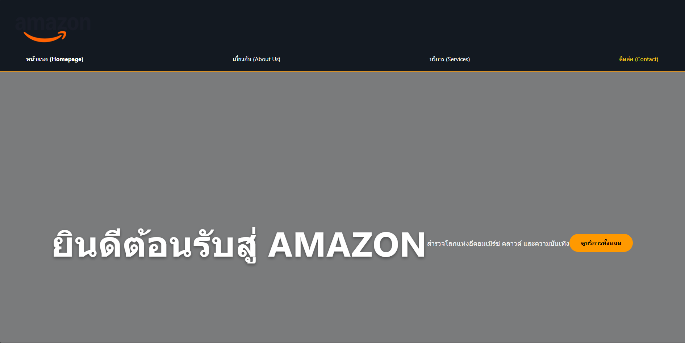
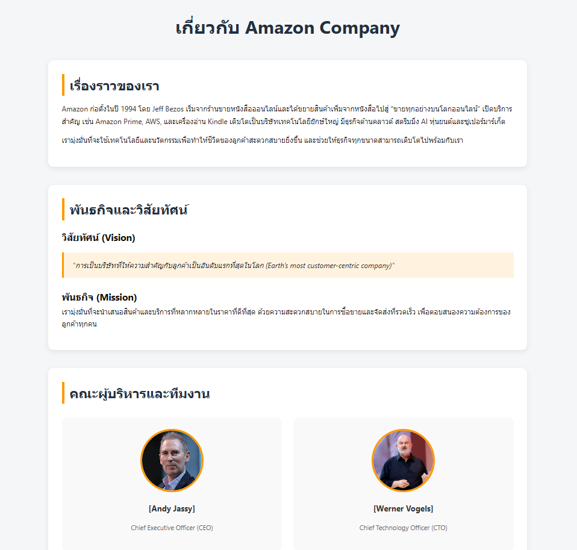
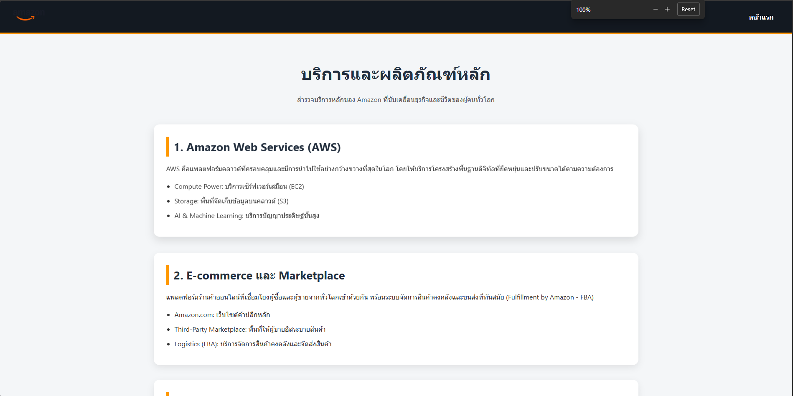
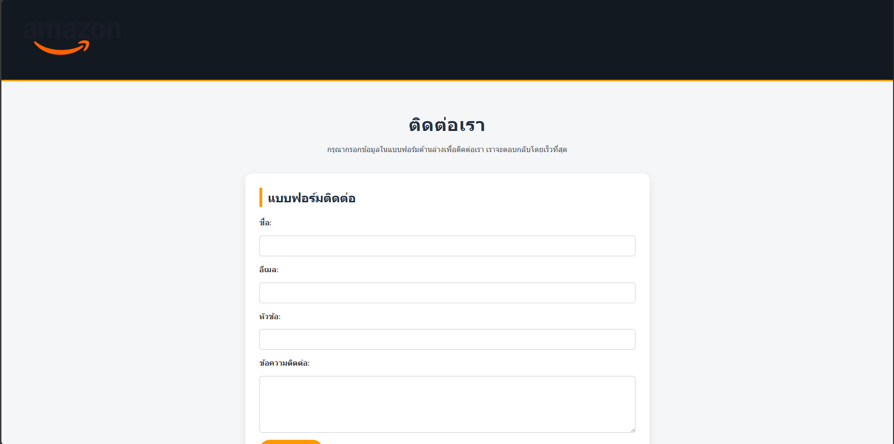

ชื่อโปรเจกต์: Amazon Company Web Prototype

คำอธิบายโปรเจกต์
โปรเจกต์นี้เป็นการพัฒนาเว็บไซต์ต้นแบบของบริษัท Amazon โดยใช้ภาษา HTML5  
เพื่อฝึกการออกแบบโครงสร้างเว็บไซต์ตามหลักพื้นฐานของการพัฒนาเว็บ  
เว็บไซต์ประกอบด้วยหน้าเว็บหลักทั้งหมด 4 หน้า ได้แก่

- หน้าแรก (Homepage)
- เกี่ยวกับเรา (About Us)
- บริการ (Services)
- ติดต่อเรา (Contact)

---

โครงสร้างไฟล์ (File Structure)

โครงสร้างไฟล์ของโปรเจกต์ถูกจัดตามมาตรฐานการพัฒนาเว็บไซต์ ดังนี้

my-business-web/
├── index.html            (Homepage)
├── about.html            (About Page)
├── services.html         (Services Page)
├── contact.html          (Contact Page)
├── css/
│ └── styles.css          (Main CSS file)
├── images/
│ ├── logo.png
│ ├── hero-bg.jpg
│ ├── service-1.jpg
│ ├── service-2.jpg
│ ├── service-3.jpg
│ ├── team-1.jpg
│ ├── team-2.jpg
│ └── ... (อื่นๆ)
├── README.md             (Project documentation)
└── .gitignore
---

ภาพรวมหน้าจอ (Screenshots)

ตัวอย่างภาพหน้าจอของแต่ละหน้าในเว็บไซต์
1  หน้าแรก (index.html): 
2  หน้าเกี่ยวกับเรา (about.html): 
3  หน้าบริการ (services.html): 
4  หน้าติดต่อ (contact.html): 

---

ลิงก์เข้าสู่แต่ละหน้า (Page Links)

- หน้าแรก (Homepage): [index.html](index.html)
- เกี่ยวกับเรา (About Us): [about.html](about.html)
- บริการ (Services): [services.html](services.html)
- ติดต่อเรา (Contact): [contact.html](contact.html)

---
สรุปข้อกำหนดที่ตรงตามคุณสมบัติ

| หน้า | ข้อกำหนด | สถานะ |
|------|----------|--------|
| index.html | Header, Navigation, Hero Section, Services (3), Footer | ✔ |
| about.html | เรื่องราวบริษัท, ทีมงาน (<figure>), Mission & Vision, ลิงก์กลับหน้าแรก | ✔ |
| services.html | รายการบริการ (<section>), ตารางเปรียบเทียบบริการ | ✔ |
| contact.html | Contact Form, ที่อยู่บริษัท, Google Map (Embed) | ✔ |

---