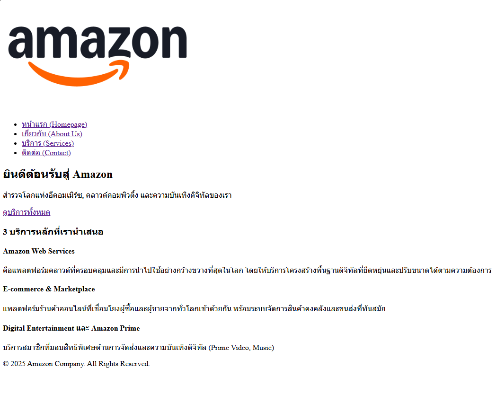
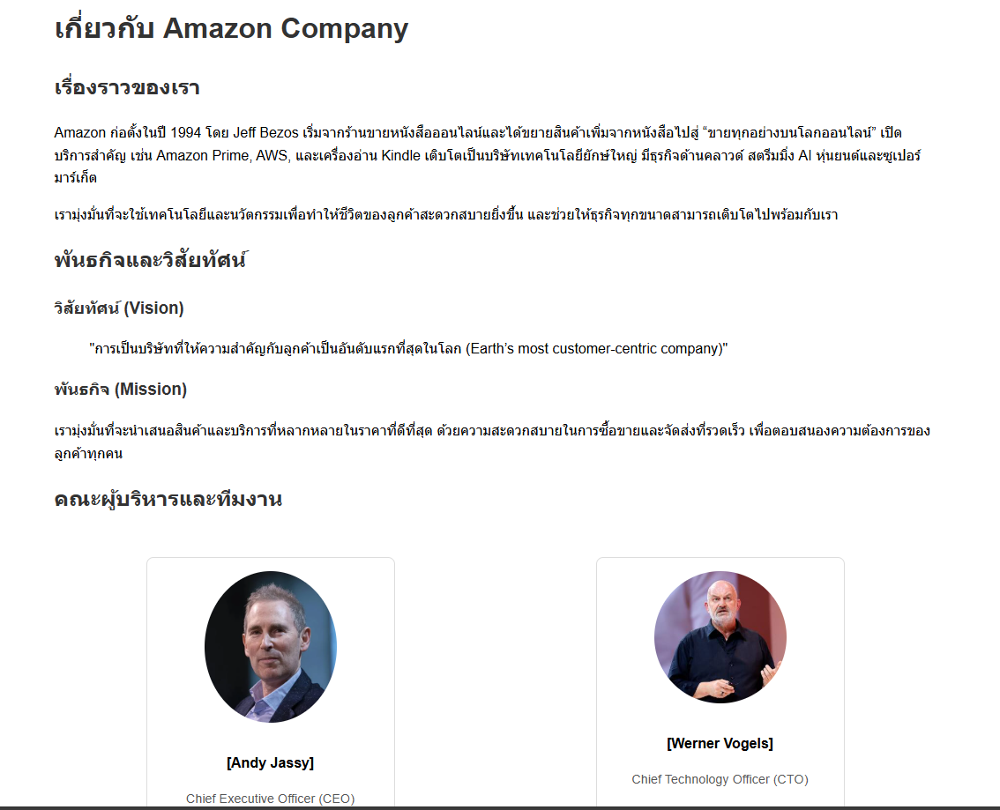
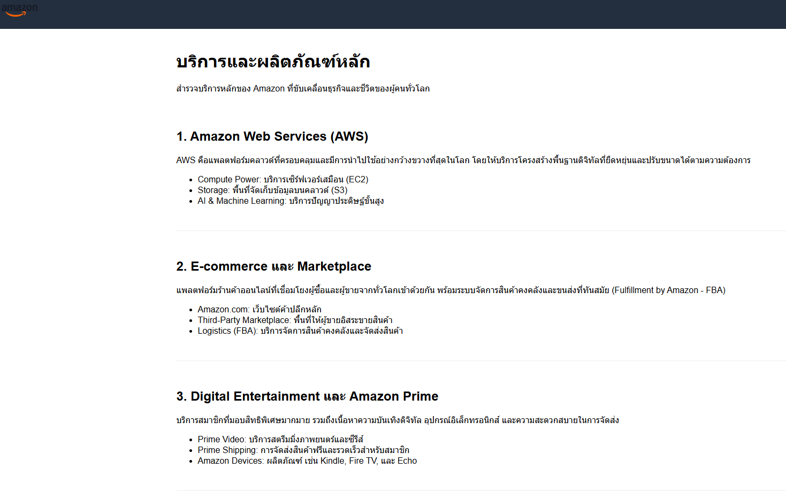
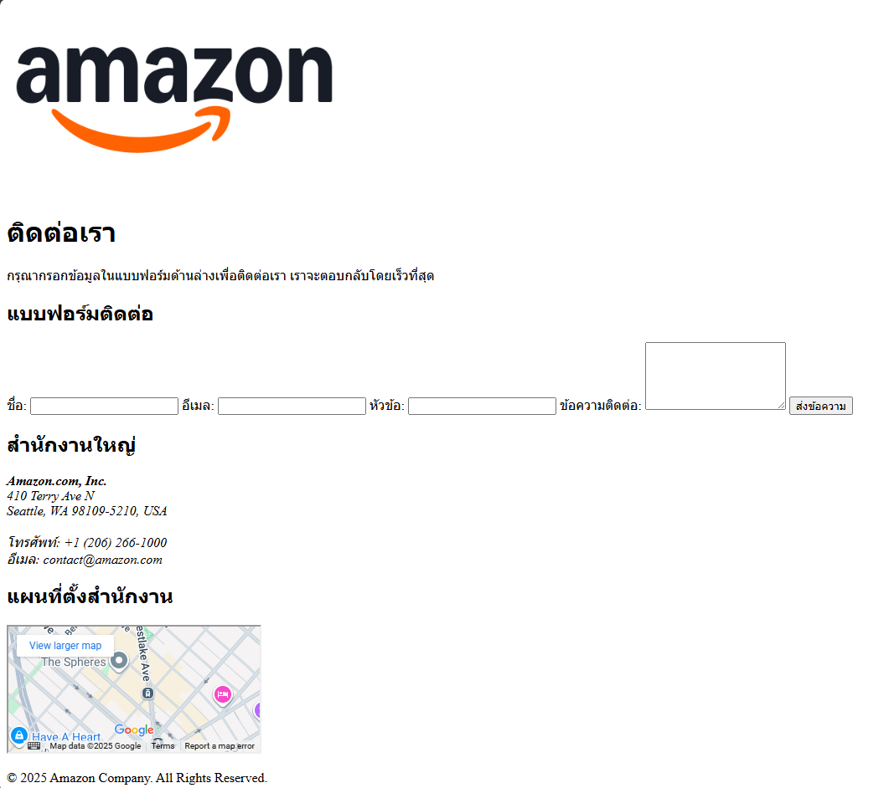

ชื่อโปรเจกต์: Amazon Company Web Prototype

คำอธิบายโปรเจกต์:
โครงการนี้คือการพัฒนาโครงสร้างพื้นฐานของเว็บไซต์บริษัท Amazon โดยใช้ HTML5 เพื่อให้เป็นไปตามข้อกำหนดการออกแบบเว็บไซต์เบื้องต้น ประกอบด้วยหน้าหลัก 4 หน้า: หน้าแรก (Homepage), เกี่ยวกับเรา (About), บริการ (Services), และ ติดต่อ (Contact)

---

โครงสร้างไฟล์ (File Structure)

โปรเจกต์นี้ใช้โครงสร้างไฟล์แบบมาตรฐานสำหรับการพัฒนาเว็บไซต์:
my-business-web
├── index.html
├── about.html
├── services.html
├── contact.html
├── images/
│ ├── logo.png
│ ├── team-member-1.jpg
│ └── ...
└── README.md
---

ภาพรวมหน้าจอ (Screenshots)

ตัวอย่างการใส่รูปภาพหน้าจอ:
1  หน้าแรก (index.html): 
2  หน้าเกี่ยวกับเรา (about.html): 
3  หน้าบริการ (services.html): 
4  หน้าติดต่อ (contact.html): 

---

ลิงก์เข้าสู่แต่ละหน้า (Page Links)
หน้าแรก (Homepage): [./index.html](index.html)
เกี่ยวกับเรา (About Us): [./about.html](about.html)
บริการ (Services): [./services.html](services.html)
ติดต่อเรา (Contact): [./contact.html](contact.html)

---
สรุปข้อกำหนดที่ตรงตามคุณสมบัติ

| หน้า | ข้อกำหนด | สถานะ |
| :--- | :--- | :--- |
| index.html | Header, Nav, Hero, Services(3), Footer |
| about.html | เรื่องราว, ทีม (<figure>), Mission/Vision, Link กลับ |
| services.html | รายการบริการ (<section>), Table เปรียบเทียบ |
| contact.html | Contact Form, ที่อยู่, แผนที่ (embed) |